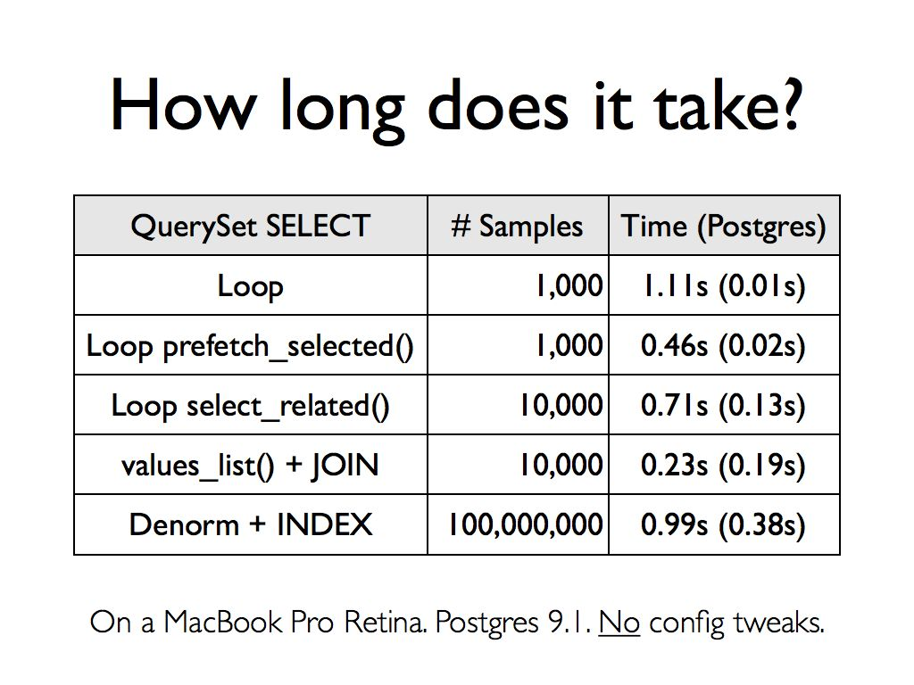

Efficient Django QuerySet Use
=============================

Code and slides from [Jayson Falkner's](http://bitapocalypse.com/jayson/about/2013/07/17/jayson-falkner/) "Efficient Django QuerySet Use".

This talk is about advanced use of Django's QuerySet API based on lessons learned at [Counsyl](https://www.counsyl.com/jobs/). You'll learn how to debug, optimize and use the QuerySet API efficiently. The main examples focus on demystifying how QuerySet maps to SQL and how seemingly simple Python code, presumably fast O(1) queries, can result in unacceptably long runtime and often O(N) or worse queries. Solutions are provided for keeping your Python code simple and RDMS use performant.

Here is one of the key slides to pique your interest. It is the same query tuned via different strategies to get optimal performance.



### Speaker Bio

Jayson Falker is a software developer for Counsyl. He has an EEN/CS degree and a PhD in Bioinformatics. He is a long-time open-source Linux/Java/Web developer, book author, and presenter. He has focused on proteomics and genomics research since the mid-2000's, including working for a few years at startups and for Dow AgroSciences. Jayson is quick to get his geek on and also loves to build ridiculous side-projects, including a 6' tall Jenga set that weighs 300lbs and mobile apps that give you awesome virtual mustaches.

### Presentations

This material comes from work experience at Counsyl and has been presented at the following events:

- Oct 10th, 2013 - [The San Francisco Django Meetup Group](http://www.meetup.com/The-San-Francisco-Django-Meetup-Group/events/141505312/) @ [Counsyl](http://maps.google.com/maps?q=180+Kimball+Way%2C+South+San+Francisco%2C+CA)
- Nov 12th 2013 - [Portland Python Users Group](http://www.meetup.com/pdxpython/events/139924722/) @ [Urban Airship](http://maps.google.com/maps?q=1417+NW+Everett+St%2C+Portland%2C+OR)

If you think this talk would be good for your user group or conference, contact jayson@counsyl.com.

### Reuse and Other Acknowledgement

You are encouraged to take this material and reuse it according to the included [MIT license](LICENSE). In short, you can use it however you like but the work is provided AS IS and you need to include the license to recognize the original authors and Counsyl.

Thanks to Counsyl co-workers Kevin Haas for original authorship of the `pg_bulk_update()` code and Constantin Berzan for guidance regarding bulk update strategies using Postgres.

Thanks to Justine Lam, Imran Haque, and Dave Peticolas for discussion and feedback on the presentation, slides and related code.

### Examples

Below are the scripts to run the examples from the slides. All scripts assume:

- You are running Python 2.7.2 (newer versions may work fine too)
- You have Django 1.5 installed
- You are in the base directory. The one with this file.
- You have `pip install sqlparse`

#### Example Set #1: QuerySet With Loop (no optimization and prefetch_related())

This set includes doing the often intuitive yet worst possible QuerySet use. The optimization method of using  `prefetch_related()` demonstrates a 10x speed increase. Examples are done with 1,000 rows in the `Sample` table.


These examples require use of the `demo` Django app included in this repository. From the base directory that this README.md file is in do the following.


```
# Setup the demo's data models.
cd demo
psql -c "CREATE DATABASE demo;"
python manage.py reset example
python manage.py syncdb

# Run the demo.
python manage.py shell
```

The rest of the commands can be copy-and-pasted in to Django's shell. For the `track_sql()` and `print_sql()` timing metrics to be helpful you must paste each complete `%cpaste` through `--` section all at once.

```
# Make up 1,000 samples to get sub-second queries for looping.
from example.utils import make_fake_data
make_fake_data()

# Run the query.
from example.models import Sample, SampleStatus
import counsyl.db
from django.db.models import Max


# Run the worst performance, looping query.
%cpaste
counsyl.db.track_sql()
results = []
samples = Sample.objects.filter(
    production=True,
    statuses__status_code=SampleStatus.LAB)
for sample in samples:
    results.append((sample.barcode, sample.status().created))
counsyl.db.print_sql()
counsyl.db.print_sql(show_queries=False)
--


# Run the prefetch_related(), looping query.
%cpaste
counsyl.db.track_sql()
results = []
samples = Sample.objects.filter(
    production=True,
    statuses__status_code=SampleStatus.LAB)
samples = samples.prefetch_related('statuses')
for sample in samples:
    results.append((sample.barcode, sample.status().created))
counsyl.db.print_sql()
counsyl.db.print_sql(show_queries=False)
--
```

#### Example Set #2: QuerySet using SQL JOIN (select_related() or annotate())

This example set relies on an SQL JOIN to 20-50x more efficiently perform the original query. Examples are using 10,000 rows in the `Sample` table.

You do not need to reset the Django `demo` app for these examples. The same code base is used for the JOIN examples.

```
# Make up 10,000 samples to get second(ish) queries for JOIN use.
from example.utils import make_fake_data
make_fake_data(samples_to_make=1000000)


# Run the JOIN without select_related()
%cpaste
counsyl.db.track_sql()
vals = list(Sample.objects
            .annotate(latest_status_code=Max('statuses__status_code'))
            .filter(production=True,
                    latest_status_code__eq=SampleStatus.LAB)
            .values_list('barcode', 'statuses__created'))
counsyl.db.print_sql()
--


# Run the select_related(), looping query. Denormalize fail.
%cpaste
counsyl.db.track_sql()
results = []
samples = Sample.objects.filter(
    production=True,
    statuses__status_code=SampleStatus.LAB)
samples = samples.select_related('latest_status')
for sample in samples:
    results.append((sample.barcode, sample.latest_status.created))
counsyl.db.print_sql()
--


```

#### Example #3: Denormalization and Multi-column INDEX

This set includes the optimal known use of QuerySet using Postgres including denormalizing the fields used for the query and a multicolumn index. This is roughly 100,000x improvement over the original query and 1,000x over the SQL JOIN based strategies. 

You will have to `reset demo`, swith to the `demo-optimized` Django app and `syncdb` in order to run these examples. The denormalized data model is slightly different than that of the original examples. 

```
# Reset the data models and load a denormalized view.
cd demo-optimized
python manage.py reset example
python manage.py syncdb


# Launch the shell.
python manage.py shell

# Make up 1,000,000 fake samples. Won't take long.
from example.utils import make_fake_data
make_fake_data(samples_to_make=1000000)


# Query without a multicolumn index.
%cpaste
counsyl.db.track_sql()
vals = list(Sample.objects
                  .filter(production=True,
                          status_code = SampleStatus.LAB)
                  .values_list('barcode', 'status_changed'))
counsyl.db.print_sql()
--


# Create the multicolumn index.
from counsyl.db import pg_multicolumn_index
pg_multicolumn_index(Sample, ['production', 'status_code'])


# Re-do the same query above but this time the index is available.
 %cpaste
counsyl.db.track_sql()
vals = list(Sample.objects
                  .filter(production=True,
                          status_code = SampleStatus.LAB)
                  .values_list('barcode', 'status_changed'))
counsyl.db.print_sql()
--


# Make 100,000,000 rows. This takes awhile!
from example.utils import make_fake_data
make_fake_data(samples_to_make=100000000, batch_threshold=1000000, make_statuses=False)


# Optimal query including multicolumn index. 100,000,000 in sub second!
%cpaste
counsyl.db.track_sql()
vals = list(Sample.objects
                  .filter(production=True,
                          status_code = SampleStatus.LAB)
                  .values_list('barcode', 'status_changed'))
counsyl.db.print_sql()
--
```


